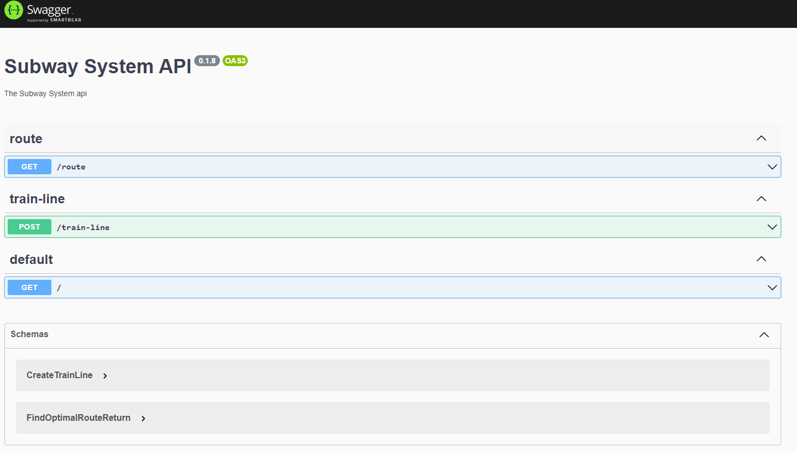
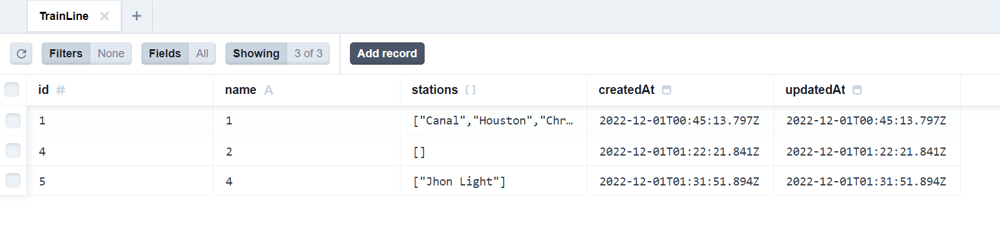
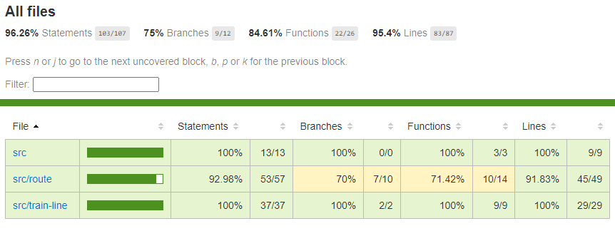

<h1><p align="center">
  Subway System Challenge
</p></h1>

## 🔧 Prerequisite

To bring up the application, you **MUST** first:

* [x] Clone the repository
   - `git clone git@github.com:wenderpmachado/subway-system.git`
* [x] Install the dependencies
   - `yarn install` or` npm install`
* [x] Set the environment variables
   - Renaming the `.env.example` file to` .env`
   - Fill in the secret information

## Installation

```bash
$ npm install
```

## Running the app

```bash
# development
$ npm run docker:up:local
```

The API will be available at http://localhost:3000/

And the Swagger at http://localhost:3000/api



## Exploring and manipulating the database

```bash
# development
$ npm run prisma:studio
```

The manager will be available at http://localhost:5555/



## Test

```bash
# unit tests
$ npm run test

# e2e tests
$ npm run test:e2e

# test coverage
$ npm run test:cov
```



<!-- ## :closed_book: License -->
## :closed_book:

Released in 2022
Made by [Wender Machado](https://github.com/wenderpmachado) 🚀
